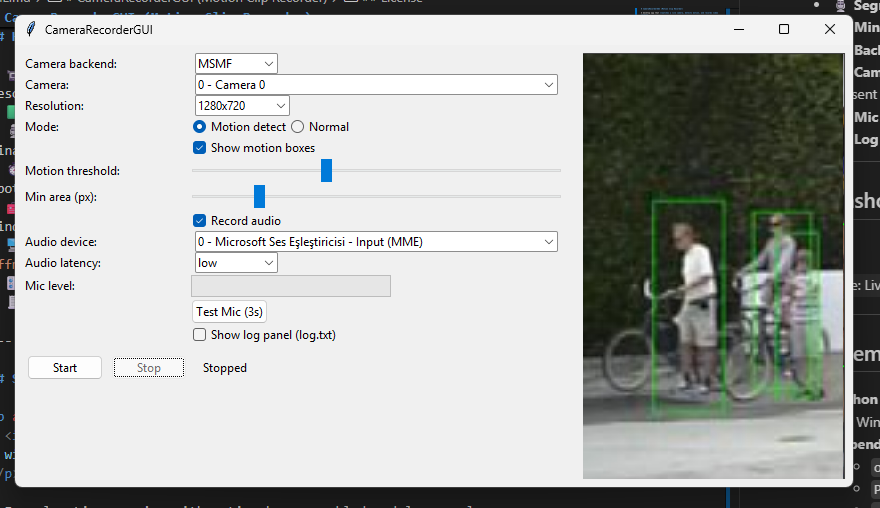

# CameraRecorderGUI (Motion Clip Recorder)

A desktop app that **watches a live camera, detects motion, and records video clips**.  
It features a **responsive preview**, **segment-synced audio**, and a **minimum duration filter** so very short events are automatically discarded.

> **Audio/video sync**: A fresh WAV is opened for each segment and muxed with the corresponding MP4, so start/stop boundaries line up cleanly.

---

## Table of Contents

- [Highlights](#highlights)
- [Screenshot](#screenshot)
- [Requirements](#requirements)
- [Run](#run)
- [Controls & UI](#controls--ui)
- [Build a Windows .exe (PyInstaller)](#build-a-windows-exe-pyinstaller)
- [Tips & Troubleshooting](#tips--troubleshooting)
- [Project Structure](#project-structure)
- [License](#license)

---

## Highlights

- 📹 **Responsive preview** — preview canvas resizes to the chosen recording resolution and scales with the window
- 🟩 **Motion detection** — optional boxes overlay; flicker-free preview
- 🎙️ **Segment-synced audio** — a separate WAV is created per clip; muxed into final MP4 (`*.av.mp4`)
- ⏱️ **Min clip length** — clips shorter than **3.0s** are automatically deleted (both `.mp4` and `.wav`)
- 🧰 **Background mux** — ffmpeg runs in the background (no flashing console windows)
- 🖥️ **Camera names on Windows** — via `ffmpeg -f dshow -list_devices true` if `ffmpeg.exe` is present
- 🎛️ **Mic level meter + Test Mic** — quick sanity check for input devices
- 🧾 **Log panel** — `log.txt` tail in the UI, toggle on/off

---

## Screenshot

<p align="center">
  
</p>

> Example: Live preview with motion boxes enabled and log panel open.

---

## Requirements

- **Python** 3.10+ (tested with 3.11)
- **OS**: Windows/Linux/macOS (Windows gets extra features like camera names)
- **Dependencies (runtime)**:
  - `opencv-python`
  - `Pillow`
  - `numpy`
  - `sounddevice` _(optional; required only for audio capture)_
- **Optional**: [`ffmpeg`](https://github.com/BtbN/FFmpeg-Builds/releases) on PATH or placed next to the executable for muxing audio and listing Windows camera names

> Tkinter is part of the standard library on most Python distributions (ensure your Python includes Tcl/Tk).

### Quick install

```bash
python -m venv .venv
# Windows
.venv\Scripts\activate
# macOS/Linux
source .venv/bin/activate

pip install --upgrade pip
pip install opencv-python Pillow numpy sounddevice
```

---

## Run

```bash
python motion-clip-recorder.py
```

- The app window shows device options on the left and a live preview on the right.
- Choose **backend**, **camera**, **resolution**, and **mode** (Motion/Normal).
- Enable **Record audio** to include mic audio (requires `sounddevice`).
- Click **Start** to begin. Motion mode will **start/stop** clips based on motion presence (with a small hold time to avoid flicker).

### Output

- Video-only segments: `recordings/motion_YYYY-MM-DD_HH-MM-SS.mp4`
- Audio for that segment: `recordings/motion_... .wav`
- After mux (if `ffmpeg` present): `recordings/motion_... .av.mp4`  
  Raw `.mp4` and `.wav` are removed after successful mux.
- Clips **< 3.0 seconds** are deleted automatically.

---

## Controls & UI

- **Mode**
  - _Motion detect_: starts on motion, stops when motion ends (with a short hold)
  - _Normal_: records continuously
- **Show motion boxes**: draws green boxes on detected regions
- **Motion threshold / Min area**: sensitivity/size controls
- **Record audio**: enables mic capture
- **Audio device**: pick from available input devices (via `sounddevice`)
- **Audio latency**: low/high hint
- **Mic level**: instantaneous level meter
- **Test Mic (3s)**: records a 3s sample and saves a WAV to verify audio
- **Show log panel**: toggles log tail view (`log.txt`)

---

## Build a Windows .exe (PyInstaller)

A convenience script **`build.bat`** is included. It:

- Creates a virtualenv
- Installs dependencies + PyInstaller
- Builds a **one-file**, **no-console** executable
- Optionally copies `ffmpeg.exe` next to the EXE

**Edit these at the top of `build.bat`:**

- `APP_NAME=CameraRecorderGUI`
- `MAIN=motion-clip-recorder.py`
- `ICON=app.ico` _(optional)_
- `FFMPEG_SRC=ffmpeg.exe` _(optional)_

Then run:

```bat
build.bat
```

The resulting binary will be in: `dist\CameraRecorderGUI.exe`  
Build logs are in `build_log.txt` (the script will tail the last 60 lines on completion).

> Note for Windows: Global multimedia access and background ffmpeg use can trigger antivirus heuristics on unsigned binaries. Code-sign your EXE or whitelist during development.

---

## Tips & Troubleshooting

- **No camera shown / black preview**  
  Try switching backend (MSMF/DSHOW on Windows, AUTO elsewhere) or a lower resolution.
- **Audio not recorded**  
  Ensure `sounddevice` is installed and the chosen input has channels > 0. Use **Test Mic** to verify.
- **Mux skipped**  
  The app logs “Mux skipped (missing ffmpeg or audio)” if no `ffmpeg` was found or there was no WAV/MP4 pair.
- **Short clips missing**  
  Clips under `MIN_SEG_SECONDS` (default **3.0s**) are intentionally deleted.
- **Performance**  
  Preview FPS is capped to reduce CPU. Recording uses the camera’s FPS (estimates if unknown).

---

## Project Structure

```
.
├─ motion-clip-recorder.py          # main app (CameraRecorderGUI)
├─ build.bat                        # one-click Windows build
├─ recordings/                      # output folder (auto-created)
├─ log.txt                          # rotating/append log
├─ ffmpeg.exe                       # (optional, same dir or on PATH)
└─ app.ico                          # (optional icon for the EXE)
```

---

## License

MIT — feel free to use in commercial and non-commercial projects. See `LICENSE`.
